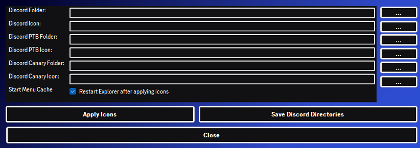

<h1 align="center">
    DIR - Discord Icon Replacer
     
</h1>

   
  
   
  Replace Discord Icons Easily
   

  <a href="#general-usage">General usage</a>
  &nbsp;&nbsp;&nbsp;•&nbsp;&nbsp;&nbsp;
  <a href="https://sherlockproject.xyz/usage">Usage</a>
  &nbsp;&nbsp;&nbsp;•&nbsp;&nbsp;&nbsp;
  <a href="#license">License</a>

</a>

  
  
  

## General usage

> [!WARNING]
> 1 - Close all your Discord Apps before using the tool:
>
> 2 - Pick an icon inside the `icons` folder for your Discord, Discord PTB and Discord Canary builds.

## Technologies
- [**C#**](https://dotnet.microsoft.com/en-us/languages/csharp) - For the general backend development;
  

## Contact
### **Learn more about me at:**
- ⚡ [**LinkedIn**](https://linkedin.com/in/douglas-kitagawa/)
- 📫 [**E-mail**](mailto:douglaskitagawa@proton.me)
- 👨🏻‍💻 [**Github**](https://github.com/sdkitagawa)
- 📺 [**Youtube**](https://www.youtube.com/@dkitagawa)
- 📺 [**Twitch**](https://www.twitch.tv/kitbitdots)

## License
Copyright © Douglas Kitagawa's (dkitagawa's) Development - Licensed under [GNU General Public License v3.0](./LICENSE.bib)