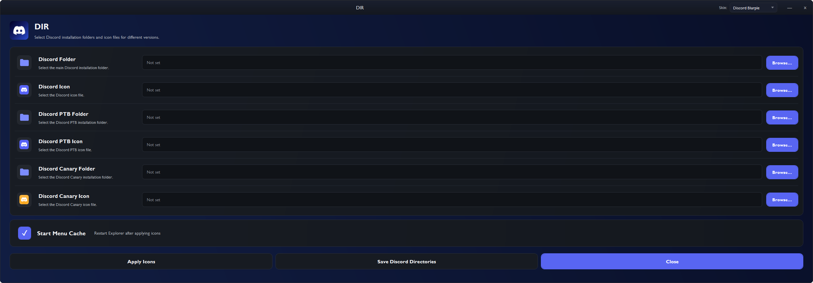
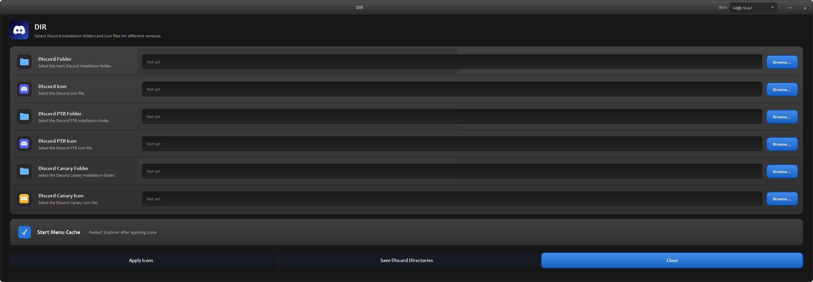
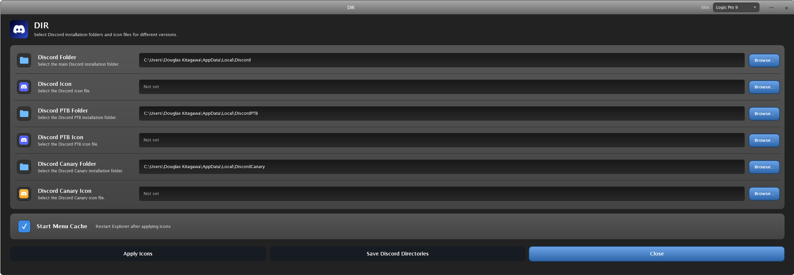

<h1 align="center">
    DIR - Discord Icon Replacer
    <br />
</h1>

<p align=center>
  <br />
  
  <br />
  <span>Replace Discord Icons Easily</span>
  <br />
</p>

<p align="center">
  <a href="#general-usage">General Usage</a>
  &nbsp;&nbsp;&bull;&nbsp;&nbsp;
  <a href="#requirements">Requirements</a>
  &nbsp;&nbsp;&bull;&nbsp;&nbsp;
  <a href="#tools--technologies">Tools</a>
  &nbsp;&nbsp;&bull;&nbsp;&nbsp;
  <a href="#architecture">Architecture</a>
  &nbsp;&nbsp;&bull;&nbsp;&nbsp;
  <a href="#testing">Testing</a>
  &nbsp;&nbsp;&bull;&nbsp;&nbsp;
  <a href="#license">License</a>
</p>

<p align="center">
  <a href="#" title="Build Passing"></a>
  
  <a href="https://dotnet.microsoft.com/en-us/languages/csharp" title="C#"></a>
  <a href="https://dotnet.microsoft.com/en-us/download/dotnet-framework/net472" title=".NET Framework"></a>
  <a href="https://visualstudio.microsoft.com/" title="Visual Studio 2022"></a>
</p>

<p align=center>
  <br />
  <b><span>Default Skin</span></b>
  <br />
  <br />
  
  <br />
  <br />
  <b><span>Logic Pro 12.3.1 Skin</span></b>
  <br />
  <br />
  
  <br />
  <br />
  <b><span>Logic Pro 9 Skin</span></b>
  <br />
  <br />
  
  <br />
</p>

---

## General Usage

> [!WARNING]
> 1. Close all Discord apps before using the tool.
> 2. Pick an icon inside the `icons` folder for your Discord, Discord PTB, and Discord Canary builds. The default icons are copied next to the executable at build time.

---

## Requirements

| Requirement | Version |
|-------------|---------|
| **OS** | Windows 10 / 11 |
| **Visual Studio** | 2022 (Community, Professional, or Enterprise) |
| **.NET Framework** | 4.7.2 targeting pack |
| **C# Language** | 12.0 (Roslyn) |
| **IWshRuntimeLibrary** | COM reference (Windows Script Host) |

### Opening the Project

1. Open `DIR.sln` in **Visual Studio 2022**.
2. Restore NuGet packages: **Build > Restore NuGet Packages**.
3. Build: **Build > Build Solution** (`Ctrl+Shift+B`).

> [!NOTE]
> This is a .NET Framework 4.7.2 **WPF** project. It requires the full Visual Studio IDE for XAML designer workflows. VS Code does not support WPF designer workflows.

### Building Release Binaries

The solution defines four build configurations. From the solution root:

```bash
# x64 Release
msbuild DIR.sln /p:Configuration=Release /p:Platform=x64

# x86 Release
msbuild DIR.sln /p:Configuration=Release /p:Platform=x86
```

Output lands in `DiscordIconReplacer\bin\x64\Release\` and `DiscordIconReplacer\bin\x86\Release\` respectively. The four default icons (`discord.ico`, `ptb.ico`, `canary.ico`, `dir_box.ico`) are copied into an `icons\` folder next to the executable by the build.

---

## Tools & Technologies

| Tool | Purpose |
|------|---------|
| [C# 12.0](https://dotnet.microsoft.com/en-us/languages/csharp) | Language |
| [.NET Framework 4.7.2](https://dotnet.microsoft.com/en-us/download/dotnet-framework/net472) | Runtime |
| [Visual Studio 2022](https://visualstudio.microsoft.com/) | IDE |
| [WPF](https://learn.microsoft.com/en-us/dotnet/desktop/wpf/) | UI framework |
| [Windows Forms FolderBrowserDialog](https://learn.microsoft.com/en-us/dotnet/api/system.windows.forms.folderbrowserdialog) | Folder picker behind `IFileDialogService` |
| [IWshRuntimeLibrary](https://learn.microsoft.com/en-us/previous-versions/windows/desktop/script56/winscript) | COM - Windows Script Host (shortcut manipulation) |
| [xUnit](https://xunit.net/) | Unit testing framework |
| [Moq](https://github.com/moq/moq4) | Mocking library |
| [FluentAssertions](https://fluentassertions.com/) | Test assertion library |

---

## Architecture

```
DIR.sln
├── DiscordIconReplacer/                (Main WPF application)
│   ├── App.xaml / App.xaml.cs          Application entry, crash logging, skin bootstrap
│   ├── MainWindow.xaml / MainWindow.xaml.cs
│   ├── Constants/                      Shared constants (VersionPatterns)
│   ├── Controls/                       WPF custom controls (DirectoryRow, TitleBar, ToastNotification)
│   ├── Facades/                        Application services (AppIconReplaceFacade, ShortcutUpdateFacade)
│   ├── Models/                         DTOs as immutable records (AppIconReplaceRequest, ShortcutUpdateRequest)
│   ├── Services/                       Business logic & abstractions
│   │   ├── IFileDialogService          Dialog abstraction (returns string, no UI coupling)
│   │   ├── DialogFilter                Pure open-file dialog filter builder (unit-testable)
│   │   ├── IIconReplacer               Icon replacement abstraction
│   │   ├── IShortcutUpdater            Shortcut update abstraction
│   │   └── StartMenuShortcutLocator    Start Menu shortcut discovery
│   ├── SystemServices/                 OS interaction (SystemService)
│   ├── Skins/                          Theme switching (SkinManager)
│   ├── Themes/                         Resource dictionaries (Main, Logic12, LogicPro9)
│   ├── Properties/                     Assembly metadata, user settings
│   └── IsExternalInit.cs               Polyfill for C# 9+ records on .NET Framework
│
└── DiscordIconReplacer.Tests/          (57 xUnit unit tests)
    ├── Services/                       AppIconReplacer, DialogFilter, StartMenuShortcutLocator, ShortcutUpdater
    └── Facades/                        AppIconReplaceFacade, ShortcutUpdateFacade
```

### Design Principles

- **Dependency Inversion**: Services accessed via interfaces (`IIconReplacer`, `IShortcutUpdater`, `IFileDialogService`); injected into `MainWindow` with a parameterless default for the WPF `StartupUri`.
- **Decoupled UI**: `IFileDialogService` returns `string?` instead of mutating `TextBox` controls.
- **Immutable DTOs**: `record` types for `AppIconReplaceRequest` and `ShortcutUpdateRequest`.
- **Guard clauses everywhere**: every service validates preconditions with early returns before touching files, COM, or the happy path.
- **Failure isolation**: `AppIconReplaceFacade` and `ShortcutUpdateFacade` swallow per-request failures and continue; `App` surfaces unhandled UI exceptions instead of hiding them.
- **File-scoped namespaces**: Modern C# 10+ syntax throughout.
- **Single Source of Truth**: Shared `VersionPatterns.DiscordVersionFolder` regex (no duplication).

---

## Testing

Run all tests from the command line:

```bash
dotnet test DiscordIconReplacer.Tests\DiscordIconReplacer.Tests.csproj
```

Or from Visual Studio: **Test > Run All Tests** (`Ctrl+R, A`).

> [!NOTE]
> Tests are deterministic and isolated: they use `%TEMP%` scratch directories, never launch modal dialogs, and never touch COM shortcut or Explorer restart paths (those are OS boundaries exercised manually).

### Test Coverage

| Test Class | Tests | What It Covers |
|------------|-------|----------------|
| `AppIconReplacerTests` | 15 | File copy, directory guards, version-folder matching, overwrite, missing/blank source guards |
| `StartMenuShortcutLocatorTests` | 15 | Null/empty inputs, nonexistent dirs, version-folder selection, fallback resolution, shortcut discovery |
| `ShortcutUpdaterTests` | 8 | Guard clauses (blank paths, missing file, non-`.lnk`) — no COM calls |
| `DialogFilterTests` | 8 | Open-file filter pattern building, blank input guard clauses |
| `AppIconReplaceFacadeTests` | 6 | Orchestration, empty/null requests, null entry skip, exception resilience |
| `ShortcutUpdateFacadeTests` | 5 | Orchestration, exception resilience, empty/null requests |
| **Total** | **57** | |

---

## Changelog

See the [releases](https://github.com/sdkitagawa/DIR/releases) page for the full change history. The current release is `1.8.4.1`.

---

## License

Copyright &copy; Douglas Kitagawa's (dkitagawa's) Development - Licensed under the [DK's Restricted Public License v1.2 (DRPL)](./LICENSE)