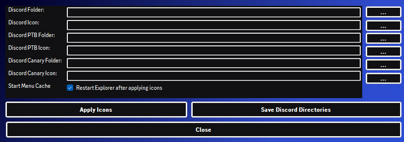

<h1 align="center">
    DIR - Discord Icon Replacer
    <br />
</h1>

<p align=center>
  <br>
  <a href="README.md"></a>
  <br />
  <span>Replace Discord Icons Easily</span>
  <br />
</p>

<p align="center">
  <a href="#general-usage">General Usage</a>
  &nbsp;&nbsp;&bull;&nbsp;&nbsp;
  <a href="#requirements">Requirements</a>
  &nbsp;&nbsp;&bull;&nbsp;&nbsp;
  <a href="#tools--technologies">Tools</a>
  &nbsp;&nbsp;&bull;&nbsp;&nbsp;
  <a href="#architecture">Architecture</a>
  &nbsp;&nbsp;&bull;&nbsp;&nbsp;
  <a href="#testing">Testing</a>
  &nbsp;&nbsp;&bull;&nbsp;&nbsp;
  <a href="#changelog">Changelog</a>
  &nbsp;&nbsp;&bull;&nbsp;&nbsp;
  <a href="#license">License</a>
</p>

<p align="center">

</p>

<p align="center">
  <a href="#" title="Build Passing"></a>
  <a href="https://github.com/sdkitagawa/DIR/tree/main?tab=GPL-3.0-1-ov-file" title="LICENSE"></a>
  <a href="https://dotnet.microsoft.com/en-us/languages/csharp" title="C#"></a>
  <a href="https://dotnet.microsoft.com/en-us/download/dotnet-framework/net472" title=".NET Framework"></a>
  <a href="https://visualstudio.microsoft.com/" title="Visual Studio 2022"></a>
</p>

---

## General Usage

> [!WARNING]
> 1. Close all Discord apps before using the tool.
> 2. Pick an icon inside the `Icons` folder for your Discord, Discord PTB, and Discord Canary builds.

---

## Requirements

| Requirement | Version |
|-------------|---------|
| **OS** | Windows 10 / 11 |
| **Visual Studio** | 2022 (Community, Professional, or Enterprise) |
| **.NET Framework** | 4.7.2 targeting pack |
| **C# Language** | 12.0 (Roslyn) |
| **IWshRuntimeLibrary** | COM reference (Windows Script Host) |

### Opening the Project

1. Open `DIR.sln` in **Visual Studio 2022**.
2. Restore NuGet packages: **Build > Restore NuGet Packages**.
3. Build: **Build > Build Solution** (`Ctrl+Shift+B`).

> [!NOTE]
> This is a .NET Framework WinForms project. It requires the full Visual Studio IDE for the WinForms designer. VS Code does not support WinForms designer workflows.

---

## Tools & Technologies

| Tool | Purpose |
|------|---------|
| [C# 12.0](https://dotnet.microsoft.com/en-us/languages/csharp) | Language |
| [.NET Framework 4.7.2](https://dotnet.microsoft.com/en-us/download/dotnet-framework/net472) | Runtime |
| [Visual Studio 2022](https://visualstudio.microsoft.com/) | IDE |
| [Windows Forms](https://learn.microsoft.com/en-us/dotnet/desktop/winforms/) | UI framework |
| [IWshRuntimeLibrary](https://learn.microsoft.com/en-us/previous-versions/windows/desktop/script56/winscript) | COM - Windows Script Host (shortcut manipulation) |
| [xUnit](https://xunit.net/) | Unit testing framework |
| [Moq](https://github.com/moq/moq4) | Mocking library |
| [FluentAssertions](https://fluentassertions.com/) | Test assertion library |

---

## Architecture

```
DIR.sln
├── DiscordIconReplacer/          (Main WinForms application)
│   ├── Constants/                Shared constants (VersionPatterns)
│   ├── Facades/                  Application services (AppIconReplaceFacade, ShortcutUpdateFacade)
│   ├── Models/                   DTOs as immutable records (AppIconReplaceRequest, ShortcutUpdateRequest)
│   ├── Services/                 Business logic & abstractions
│   │   ├── IFileDialogService    Dialog abstraction (returns string, no UI coupling)
│   │   ├── IIconReplacer         Icon replacement abstraction
│   │   ├── IShortcutUpdater      Shortcut update abstraction
│   │   └── StartMenuShortcutLocator  Start Menu shortcut discovery
│   ├── SystemServices/           OS interaction (ISystemService, SystemService)
│   ├── MainForm.cs               Main WinForms UI (partial class)
│   ├── MainForm.Designer.cs      Auto-generated designer code
│   ├── Program.cs                Entry point
│   └── IsExternalInit.cs         Polyfill for C# 9+ records on .NET Framework
│
└── DiscordIconReplacer.Tests/    (Unit & integration tests)
    ├── Services/                 AppIconReplacerTests, StartMenuShortcutLocatorTests, FileDialogServiceTests
    └── Facades/                  AppIconReplaceFacadeTests, ShortcutUpdateFacadeTests
```

### Design Principles

- **Dependency Inversion**: Services accessed via interfaces (`IIconReplacer`, `IShortcutUpdater`, etc.)
- **Decoupled UI**: `IFileDialogService` returns `string?` instead of mutating `TextBox` controls
- **Immutable DTOs**: `record` types for `AppIconReplaceRequest` and `ShortcutUpdateRequest`
- **File-scoped namespaces**: Modern C# 10+ syntax throughout
- **Single Source of Truth**: Shared `VersionPatterns.DiscordVersionFolder` regex (no duplication)

---

## Testing

Run all tests from the command line:

```bash
dotnet test DiscordIconReplacer.Tests\DiscordIconReplacer.Tests.csproj
```

Or from Visual Studio: **Test > Run All Tests** (`Ctrl+R, A`).

### Test Coverage

| Test Class | Tests | What It Covers |
|------------|-------|----------------|
| `AppIconReplacerTests` | 7 | File copy, directory guards, version folder matching, overwrite |
| `StartMenuShortcutLocatorTests` | 6 | Null/empty input handling, shortcut discovery |
| `AppIconReplaceFacadeTests` | 3 | Orchestration, empty requests, mock verification |
| `ShortcutUpdateFacadeTests` | 3 | Orchestration, exception resilience, empty requests |
| `FileDialogServiceTests` | 2 | Return type correctness, dialog integration |
| **Total** | **18** | |

---

## License

Copyright &copy; Douglas Kitagawa's (dkitagawa's) Development - Licensed under [GNU General Public License v3.0](./LICENSE)
